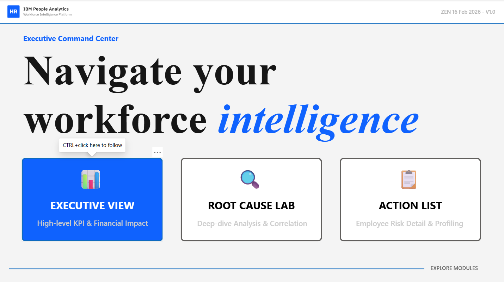
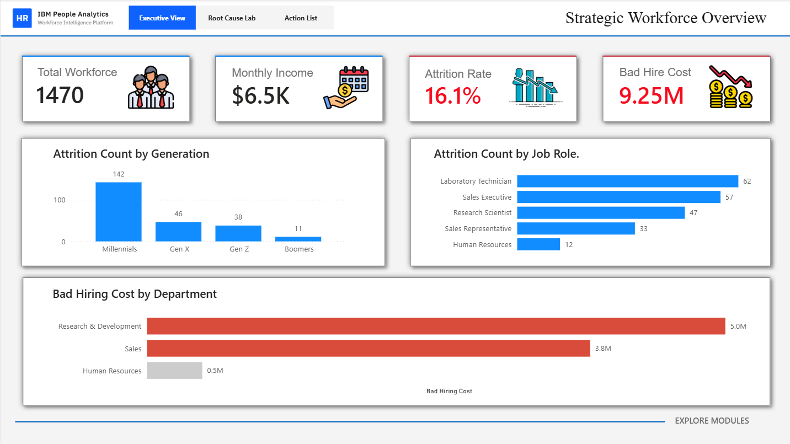
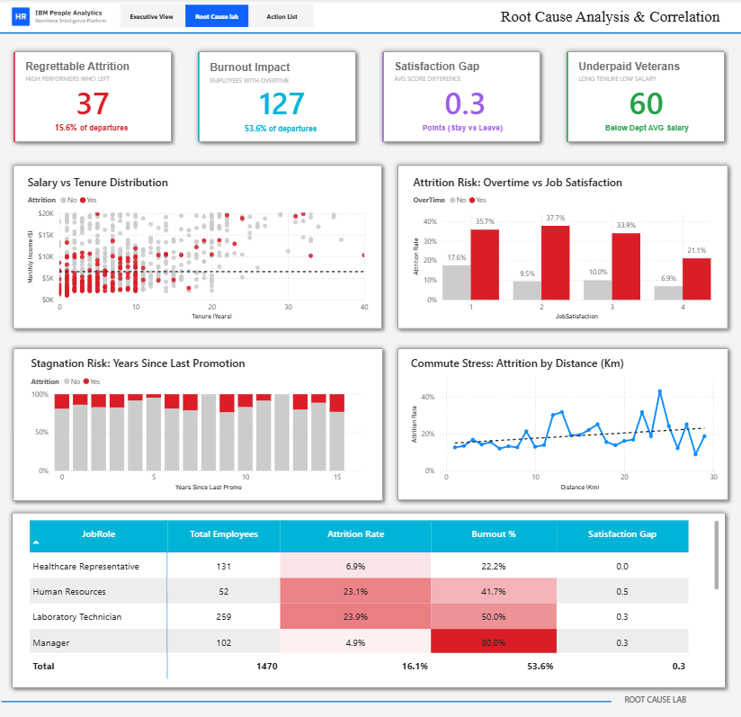
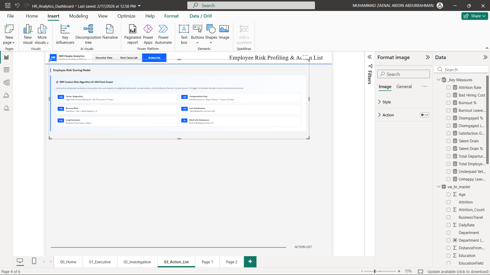

# HR Executive Command Center: Predictive Analytics & Intervention Platform


## Executive Summary

This project represents a fully realized, enterprise-grade analytics solution engineered to diagnose Employee Attrition, quantify financial impact, and prescribe data-driven retention strategies. Unlike standard descriptive dashboards that merely report past metrics, this platform functions as a **Prescriptive Analytics Application**.

By leveraging an IBM HR Analytics dataset, the system shifts the Human Resources paradigm from reactive reporting to proactive intervention. It highlights a historical $9M Bad Hiring Cost while simultaneously deploying a custom algorithmic Risk Engine to evaluate active employees, isolate root causes (e.g., compensation gaps, career stagnation), and calculate forward-looking Cost Avoidance Potential.

---

## System Architecture & Module Breakdown

The visualization layer bypasses traditional long-scroll report designs in favor of a "Navigation-First", application-like interface utilizing strict state-based logic.

### Module 00: Command Center (Landing Page)

* **Function:** Centralized navigation hub.
* **Architecture:** Utilizes distinct active/inactive button states and strict visual hierarchy to guide executive users seamlessly through the analytical modules.
* **Preview:** 

### Module 01: Executive Strategic View

* **Function:** Macro-level performance monitoring.
* **Architecture:** Delivers instant visibility into core KPIs, workforce demographic segmentation (Generational and Income brackets), and the overall financial impact of historical attrition.
* **Preview:** 

### Module 02: Root Cause Analysis Lab

* **Function:** Diagnostic engine for hypothesis validation.
* **Architecture:** Deploys multidimensional analysis to identify structural issues. Features include Salary vs. Tenure scatter plots to spot "Underpaid Veterans", a Burnout Matrix correlating overtime with job satisfaction, and a full-width risk concentration heatmap across job roles.
* **Preview:** 

### Module 03: Predictive Intervention System (Action List)

* **Function:** Row-level prescriptive action queue.
* **Architecture:** Powered by a custom DAX iteration engine, this module assigns a 0-100 risk score to every active employee. It features an Executive Summary of at-risk populations, a Pareto analysis of primary risk drivers, and a prioritized intervention table complete with dynamic diagnostic tags and conditional data bars.
* **Preview:** 

---

## Technical Implementation & Business Logic

### 1. Data Engineering & Transformation (MySQL)

To ensure processing efficiency and single-source-of-truth integrity, extensive data hardening was performed in the SQL layer before reaching the Business Intelligence environment.

* **Anomaly Resolution:** Audited and resolved critical schema ingestion errors, specifically bypassing hidden UTF-8 BOM characters in raw CSV headers.
* **Categorical Feature Engineering:** Executed database-level transformations using `CASE` statements to create analytical buckets (e.g., segmenting numerical Age into generational cohorts, and monthly income into specific socioeconomic tiers).
* **View Abstraction:** Encapsulated the final, cleaned, and transformed dataset within a master view (`vw_hr_master`), protecting the analytical layer from underlying table alterations and pre-calculating essential binary flags.

### 2. Advanced DAX & Semantic Modeling (Power BI)

The core intelligence of this platform relies on advanced Data Analysis Expressions (DAX) to evaluate context at both the macro (filter) and micro (row) levels.

* **Custom Risk Scoring Algorithm:** Engineered an iterative evaluation measure (`AVERAGEX`) that scores individual employees based on 6 weighted corporate risk factors:
* Career Stagnation (+30 points)
* Department-Level Compensation Gaps (+25 points)
* Burnout Risk / Lack of Equity (+20 points)
* Critical Dissatisfaction (+15 points)
* Commute Stress (+10 points)
* Work-Life Imbalance (+5 points)


* **Dynamic Diagnostics:** Implemented row-context logic using `MAX()` and `SUM()` wrappers to dynamically generate text-based diagnoses (e.g., "Severe Compensation Gap") for each employee in the intervention queue.
* **Financial Quantification:** Translated attrition risk into financial metrics by calculating the Cost Avoidance Potential (estimated at 6x monthly salary per retained critical employee).

### 3. Enterprise UI/UX Design

* **Visual Polish:** Maintained a strict corporate color palette (IBM Blue, Red for Critical, Orange for High Risk).
* **Data-to-Ink Ratio Optimization:** Removed default chart noise (gridlines, unnecessary axes) and utilized strategic whitespace.
* **Conditional Formatting:** Applied dynamic background colors, font colors, and integrated data bars within tables to drastically reduce the cognitive load required to parse thousands of rows of employee data.

---

## Repository Structure

```text
├── data/
│   └── HR_Employee_Attrition.csv      # Raw Data Source
│
├── visualization/
│   ├── HR_Analytics_Dashboard.pbix    # Complete Power BI Project File
│   ├── landing_page_preview.png       # Module 00 User Interface
│   ├── executive_view_preview.png     # Module 01 User Interface
│   ├── root_cause_preview.png         # Module 02 User Interface
│   └── action_list_preview.png        # Module 03 User Interface
│
├── HR_Analytics_Query.sql             # Complete MySQL Data Engineering Script
└── README.md                          # Technical Documentation

```

---

## Development Roadmap (Completed)

* [x] **Phase 1: Data Engineering** (Audit, Cleansing, SQL View Creation)
* [x] **Phase 2: Semantic Modeling** (Base DAX Measures & Financial Metrics)
* [x] **Phase 3: UI Architecture** (Landing Page & State-Based Navigation System)
* [x] **Phase 4: Strategic Dashboard** (Executive View Construction)
* [x] **Phase 5: Diagnostic Dashboard** (Root Cause Analysis Lab)
* [x] **Phase 6: Prescriptive Analytics** (Custom Risk Scoring & Action List Generation)

---

*Architected and developed by [Muhammad Zaenal Abidin Abdurrahman](https://www.linkedin.com/in/zendin1102/) - 2026*
